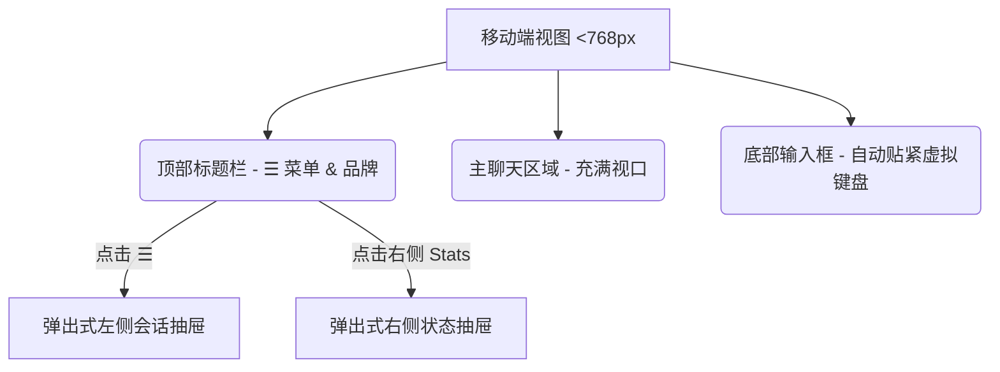

# DeepSeek-Reasonix 桌端 UI 移植 Web 端与手机端兼容详细方案

本项目旨在将 **DeepSeek-Reasonix 桌面端 (Tauri + React + CSS)** 的高颜值、 premium 级别的 UI 完整移植到 **Web 端 (CLI 挂载的 dashboard)**。放弃原有的 Preact + HTM 的旧 Web UI，采用全新的桌面端视觉设计，同时重点解决**手机端（移动端）的响应式兼容性**。

为了确保安全平稳交付，我们采用**渐进式两阶段开发**：
- **第一阶段**：在 `dashboard` 内建立独立的 Vite + React 开发环境，使用全套桌面端前端源码，并编写 Tauri 兼容层与**全套 Mock 数据模拟器**。在独立网页中实现极致的移动端自适应排版。您可以先在浏览器中独立预览效果，满意后再接入真实接口。
- **第二阶段**：在 CLI 后端加入极简的 **WebSocket / SSE 桥接层**，将前端的 React RPC 消息直接送达 CLI 内核的 NDJSON 处理器，完美融合并替换原有的打包发布流程。

---

## 核心设计亮点 & 移动端自适应方案

桌面端的设计语言非常高级，使用了 `oklch` 精细调色板、优雅的暗色/亮色切换、毛玻璃（Glassmorphism）和微妙的微交互。但在手机等窄屏设备上，原本的三栏并排布局（侧边栏、聊天主区、右侧面板）无法直接容纳。

我们将实施以下**自适应与移动端优化设计**：

### 1. 响应式视口排版 (Responsive Layout)
- **宽屏设备 (>= 1024px)**: 维持原有的三栏并列，允许通过控制按钮独立折叠左侧和右侧。
- **平板设备 (768px ~ 1023px)**: 默认折叠右侧面板（SideRail），允许点击顶部按钮拉出抽屉展示。
- **手机端 (< 768px)**: 
  - 强制网格布局从三栏平铺转换为**单栏切换布局**。
  - 左侧边栏（会话列表）转换为**侧滑式左拉抽屉 (Slide-in Drawer)**，可通过点击左上角的“汉堡菜单 ☰”或屏幕左边缘右滑拉出。
  - 右侧面板（Overview/Stats/MCP/Skills）转换为**右拉抽屉**，或归并入顶部弹出层。
  - 面板折叠状态直接通过 React State 结合 CSS `transform: translate3d()` 实现平滑的惯性滑动。



### 2. 移除 OS 桌面特性并适配 Web 规范
- **屏蔽窗口控制器**: 在 Web 环境下，自动隐藏右上角的 Windows/macOS 风格的“最小化、最大化、关闭”按钮（`.win-controls` & `.mac-controls`）。
- **取消拖拽区限制**: 剥离 Tauri 拖动窗口的特有样式（`data-tauri-drag-region`），恢复为 Web 默认的事件捕获。
- **弹窗与文件选择适配**: 将桌端所用的 `@tauri-apps/plugin-dialog`（系统原生弹窗）转换为 Web 端优雅的 React 美化对话框。当需要用户输入路径或选择文件时，提供路径联想输入或使用 Web 原生的 `<input type="file">`。

### 3. 移动端触控与输入框优化 (Mobile Ergonomics)
- **输入框（TextArea）防止缩放**: 在移动端，当 TextArea 聚焦时，iOS 容易因为字号小于 16px 触发系统强制放大。我们将通过 CSS / Metatag 锁定视口，并将 TextArea 默认字号调大。
- **虚拟键盘躲避**: 在手机浏览器上，软键盘弹起会挤压视口高度。我们将 `height: 100vh` 精确配置为 `height: 100dvh` (Dynamic Viewport Height)，保证输入框始终紧贴键盘边缘，不被遮挡。
- **按钮触控热区**: 优化操作按钮、会话卡片以及侧边栏选项的 `padding` 和 `margin`，保证每个可点击区域至少具有 `44px * 44px` 的触控面积。

---

##  Proposed Changes (拟作出的修改)

我们将对代码库进行如下重组和开发：

### Component 1: `dashboard` 重构为独立 Vite + React 项目
我们要把 `dashboard` 目录改造成一个完整的现代 React + TypeScript 项目，共享桌端的 React 核心资产。

#### [NEW] [vite.config.ts](file:///d:/AI/workspace/dashboard/vite.config.ts)
新建专属于 `dashboard` 的 Vite 配置文件。我们需要定制 Rollup 的打包策略，使得构建产物能够完美输出单文件的 `app.js` 与 `app.css`，从而无需重构 CLI 后端现有的静态资源分发路径。

#### [NEW] [tauri-bridge.ts](file:///d:/AI/workspace/dashboard/src/lib/tauri-bridge.ts)
核心的 **Tauri API Web 桥接器**。它将模拟 `@tauri-apps/api/*` 与各种 Tauri 插件：
- 如果运行在** Mock 演示模式**：在内存中实现完整的虚拟后端，拦截所有 `invoke("rpc_send")`，并通过定时器仿真 CLI 返回的 NDJSON 消息（如推理过程、工具调用卡片等）。
- 如果运行在**真实 CLI 模式**：通过 WebSocket / SSE 建立双向通信，将 `invoke` 流量实时转发给 CLI 后端。

#### [MODIFY] [App.tsx](file:///d:/AI/workspace/dashboard/src/App.tsx)
由桌面端 `desktop/src/App.tsx` 复制并演化而来：
- 替换所有的 Tauri 原生导入为我们的 `tauri-bridge` 兼容层。
- 引入 Media Queries 并在 App 组件中动态监测视口宽度。
- 为侧边栏和主界面添加响应式 CSS 类（如 `.mobile-layout`, `.drawer-open`），结合 CSS Transitions 实现极为丝滑的侧滑抽屉。

#### [MODIFY] [styles.css](file:///d:/AI/workspace/dashboard/src/styles.css)
由桌面端的 `desktop/src/styles.css` 复制并优化：
- 保留全部 premium 的暗色、 Graphite、midnight 等高级主题配色与 CSS tokens。
- 新增一整套 `@media (max-width: 768px)` 移动端适配层。
- 优化滚动条样式，在移动设备上采用原生动量滚动（`-webkit-overflow-scrolling: touch`）。

---

## 第一阶段：单独网页预览 (Mock Preview) 效果验证

为了能快速让您直观评估全新视觉设计和手机兼容性，我们将在独立网页中预装一个**虚拟协议模拟器**。
当您使用 `npm run dev` 运行 `dashboard` 时，无需打开真正的 CLI，网页即可完美渲染出完整的桌端 UI：
1. **自动引导环境**：模拟首次打开时的 API Key 设置与工作区加载流程。
2. **打字机推理效果**：展现 DeepSeek 模型经典的“思维链思考（Reasoning Context）”与回答打字效果。
3. **工具调用动画**：模拟 `view_file`、`run_command` 的调用气泡与进度。
4. **会话切换与主题变幻**：支持在左侧切换多个预设的模拟会话，点击右下角按钮在 graphite, midnight 等高级主题间一键无缝闪切。
5. **手机仿真**：您可以使用 Chrome 开发者工具的“设备模拟器”将其切到 iPhone / Android 视图，直接用手势拖拉抽屉，查看触控响应。

---

## Verification Plan (验证计划)

### 1. 独立效果验证 (第一阶段)
- **编译与运行**: 在 `dashboard` 目录下运行 `npm run dev` 启动 Vite 开发服务。
- **多端设备覆盖**: 
  - **PC 浏览器**: 验证暗/亮色主题、高级玻璃拟态和会话切换。
  - **手机仿真/真实手机**: 局域网下用真实手机访问，验证左滑菜单、贴紧虚拟键盘的 Dynamic Viewport 表现、以及触控体验。

### 2. 真实 CLI 对接验证 (第二阶段)
- **CLI 编译发布**: 运行 `npm run build` 打包 CLI 静态资源。
- **命令行启动验证**: 运行 `reasonix code --open-dashboard`，在真实浏览器中体验与真实 CLI 的完全功能联调。

---

## 当前修订：桌面端 Web 优先收口方案

> 2026-05-20 修订：当前策略调整为 **先跑通桌面端 Web 的真实 CLI 链路，再优化手机端**。真实验收入口是 CLI 打开的动态 token URL，例如 `http://127.0.0.1:62197/?token=xxxx`；Vite `:3000` 仅用于 Mock 视觉预览，不作为真实功能验收依据。

### 阶段 A：桌面端 Web 跑通（最高优先级）

目标：在 Windows 桌面浏览器中，通过 `code --open-dashboard` 打开的 token URL 完成真实 CLI 使用闭环。

1. **固定真实启动流程**
   ```powershell
   cd D:\AI\workspace\dashboard
   npm run build
   cd D:\AI\workspace
   npx tsx src/cli/index.ts code --open-dashboard
   ```
2. **首屏验收**
   - 只使用 CLI 打开的 `http://127.0.0.1:<port>/?token=<token>`。
   - 页面 3 秒内从 `loading…` 进入完整 React UI。
   - `tauri-bridge` 识别为 `mode=server`，不是 `mode=mock`。
   - 初始 `$tab_opened`、`$settings`、`$sessions`、`$ready` 全部落到当前 tab。
3. **基础功能闭环**
   - 输入一条短消息，用户消息立即显示。
   - 助手流式输出正常，`assistant_delta` 与 `assistant_final` 不丢失、不重复。
   - `busy-change` 能正确控制输入框、停止按钮和发送按钮状态。
   - 点击停止时，`POST /api/abort` 成功，UI 回到可输入状态。
4. **工具与弹窗闭环**
   - 覆盖一次 `tool_start` 到 `tool` 的工具卡片展示。
   - 覆盖一次确认/选择/计划类弹窗，确认回传到 `POST /api/modal`。
   - 后端退出或中断时，页面给出可理解提示，而不是静默卡死。

### 阶段 B：桌面端协议与稳定性补齐

目标：让桌面端 Web 不只是“能用”，而是“连续使用不坏”。

1. **RPC 与 REST 路由对齐**

   | 前端命令 | 应调用的 REST |
   | --- | --- |
   | `session_list` | `GET /api/sessions` |
   | `session_load` / 切换会话 | `POST /api/sessions/:name/switch` |
   | `session_delete` | `DELETE /api/sessions/:name` |
   | `new_chat` | `POST /api/sessions/new` 后重新 `GET /api/sessions` |

   `new_chat` 成功后不要依赖后端返回 `name`；后端当前返回 `{ ok: true }`，前端应重新拉取会话列表，并根据 `currentSession` 或最新列表刷新 UI。

2. **SSE 稳定性**
   - `/api/events?token=...` 建立后服务端不能崩溃。
   - 断线重连不会重复创建 turn、重复追加消息或丢失 busy 状态。
   - 服务端 ping 只保活，不改变 UI 状态。

3. **异常状态设计**
   - token 无效：显示“链接已过期，请重新从 CLI 打开”。
   - SSE 断开：显示“正在重连”，重连成功后自动恢复。
   - 后端退出：显示“CLI 已停止”，禁用发送。
   - `/api/submit` 失败：保留用户输入，不吞掉草稿。
   - 构建产物缺失：CLI 启动时给明确提示，避免白屏。

4. **安全边界**
   - GET/HTML/SSE 可使用 URL query token。
   - POST/DELETE 必须使用 `x-reasonix-token` header。
   - 日志避免打印完整 token。
   - 局域网绑定默认关闭，桌面端阶段只验证 `127.0.0.1`。

### 阶段 C：桌面端验收矩阵与自动化

目标：把“可用”固化成可重复验证的标准。

| 场景 | 验收标准 |
| --- | --- |
| 首屏加载 | token URL 3 秒内进入完整 UI，不停留 `loading…` |
| 会话列表 | 能加载、切换、新建、删除非当前会话 |
| 消息发送 | 连续 3 轮消息不丢、不重、不乱序 |
| SSE | 断线重连后 UI 状态一致 |
| REST | submit / abort / sessions / modal 全部返回预期 |
| 安全 | 无 token 访问 HTML/API 被拒绝，POST 必须 header token |
| 构建 | `dashboard/dist/app.js` 与 `dashboard/dist/app.css` 存在并被 CLI 加载 |

建议新增轻量 smoke test：

```powershell
cd D:\AI\workspace\dashboard
npm run build
cd D:\AI\workspace
npm run typecheck
npm run test -- dashboard server
```

后续可增加浏览器自动化检查：打开 token URL，断言页面不含 `loading…`，console 无 error，且至少存在侧边栏、主聊天区、输入框三个核心区域。

### 阶段 D：构建与发布整理

目标：让真实桌面端 Web 启动流程对用户透明。

1. 根项目 `npm run build` 应自动先构建 `dashboard`：
   ```json
   {
     "build:dashboard": "npm --prefix dashboard run build",
     "build": "npm run build:dashboard && tsup && node scripts/copy-dashboard-vendor-css.mjs"
   }
   ```
2. `dashboard/dist/app.js`、`dashboard/dist/app.css` 只由构建生成，不手写修改。
3. `code --open-dashboard` 启动前检查构建产物是否存在；缺失时提示先运行 dashboard build 或自动触发构建。
4. Web 端继续清理桌面 updater，保持更新由 CLI/npm 管理。

### 阶段 E：手机端与移动体验优化（桌面端通过后）

移动端排在桌面 Web 稳定之后执行，避免协议问题和响应式问题混在一起。

1. **桌面窄屏模拟**
   - Chrome/Edge 先用 390px、430px、768px 三档宽度验证布局。
   - 确认抽屉、遮罩、输入框、右侧上下文面板没有重叠。
2. **真实手机访问**
   - 手机不能访问 PC 的 `127.0.0.1`，需要服务端显式绑定 `0.0.0.0` 或 PC 局域网 IP。
   - 手机访问 `http://<PC局域网IP>:<端口>/?token=<同一令牌>`。
   - token 是 dashboard 访问凭证，不公开传播。
3. **机型覆盖**
   - iPhone Safari。
   - Android Chrome。
   - Windows Edge 窄屏模拟。
4. **移动端验收**
   - 左侧会话抽屉可打开/关闭。
   - 右侧上下文面板在窄屏可访问。
   - 输入框聚焦不触发 iOS 放大，软键盘不遮挡发送按钮。
   - 滚动有惯性，触控热区不小于 44px。

### 暂缓项

以下内容等桌面端 Web 稳定后再做：

1. `app.js` 拆包与首屏性能深度优化。
2. 移动端视觉精修。
3. 多浏览器细节打磨。
4. 高级离线/重连恢复策略。
